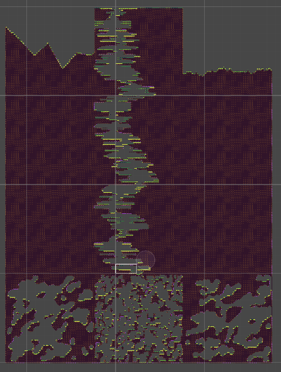
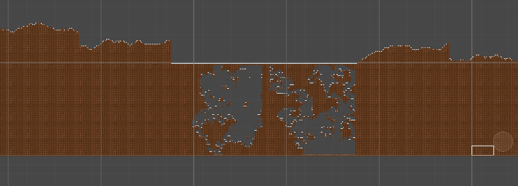

# Compilador

El lenguaje diseñado te permite generar mapas 2D en Unity. El lenguaje hace uso de los tilemaps de Unity para generar los mapas. Los mapas son generados de manera aleatoria mediante alguno de los algoritmos disponibles, los cuales hacen uso del Perlin Noise y funciones Aleatorias, mediante el uso de una semilla, puedes ir obteniendo diferentes mapas hasta encontrar uno que te guste y al mantener la misma semilla, siempre obtendras el mismo mapa. El lenguaje ofrece la posibilidad de definir secciones, las cuales podras ir acomodando a tu gusto dentro del mapa mediante la funcion join. Las secciones serán dibujadas mediante una RuleTile, la cual, podras definir dentro del lenguaje como un smarttile. [Aquí](#Ejemplos) puedes encontrar algunos de los resultados que el lenguaje puede generar.

Este proyecto fue realizado por: 

- Graciano Herrera Gabriel: https://github.com/Gabriel-Graciano-Herrera-2019630012
  - Olmedo Ramirez Esteban Raymundo: https://github.com/esteban-olmedo-ramirez-2019630134
- Montes Guerrero Daniel: https://github.com/daniel-montes-guerrero-2019630019

## Requisitos previos

Para poder utilizar el codigo que entrega el compilador necesitas tener dentro de tu proyecto de unity los archivos que se encuentran en [esta carpeta](LanguageTesting). Cabe recalcar que solo funciona para Unity en un entorno de Linux.

Se debe tener un conocimiento previo de Unity.

## Lenguaje

A continuación se muestra la estructura que debe tener tu archivo para que pueda ser compilado con exito.

```
Declaración del tamaño de tus secciones
Declaración de tus sections y/o Declaración de tus Smarttiles
Main
```

### Declaración del tamaño de tus Sections

La sintaxis para declarar el tamaño que tendran tus **Sections** es la siguiente:

```
set size = {ancho,alto};
```

A continuación se muestra un ejemplo de la declaración del tamaño de las secciones:

```
set size = {100,100};
```

 En este caso tus secciones tendran un tamaño de 100 de ancho x 100 de alto

### Declaración de las Sections

La sintaxis para declarar las **Sections** es el siguiente

```
section IDENTIFICADOR : ALGORITMO {
	Parametros del algoritmo
}
```

NOTA: **El IDENTIFICADOR debe ser único para cada sección**

A continuación se muestra una tabla con cada algoritmo para la generación de los mapas y sus respectivos parametros

|          Algoritmo          |                          Parametros                          |
| :-------------------------: | :----------------------------------------------------------: |
|         PerlinNoise         |                          float seed                          |
|     PerlinNoiseSmoothed     |               float seed<br/>	int interval                |
|         RandomWalk          |                          float seed                          |
|     RandomWalkSmoothed      |            float seed<br/>	int minSectionWidth            |
|       PerlinNoiseCave       | float seed<br/>	float modifier<br/>	bool edgeAreWalls  |
|       RandomWalkCave        |         float seed<br/>	int requiredFloorPercent          |
|      DirectionalTunnel      | float seed<br/>	int minPathWidth<br/>	int maxPathWidth<br/>	int maxPathChange<br/>	int roughnes<br/>	int curvyness |
|  GenerateCellularAutomata   | float seed<br/>	int height<br/>	int fillPercent<br/>	bool edgeAreWalls |
|  GetMooreSurroundingTiles   | float seed<br/>	int x<br/>	int y<br/>	bool edgeAreWalls |
| SmoothMooreCellularAutomata | float seed<br/>	bool edgeAreWalls<br/>	int smoothCount |
|    GetVNSurroundingTiles    | float seed <br/>	int x<br/>	int y<br/>	bool edgeAreWalls |
|  SmoothVNCellularAutomata   | float seed<br/>	bool edgeAreWalls<br/>	int smoothCount |

NOTA: **TANTO LOS NOMBRES DE LOS ALGORITMOS COMO LOS DE LOS PARAMETROS SON PALABRAS RESERVADAS, ADEMÁS ES RESPONSABILIDAD DEL PROGRAMADOR UTILIZAR LOS PARAMETROS CORRECTOS CORRESPONDIENTES PARA CADA ALGORITMO.**

A continuación se muestra un ejemplo con la declaración de una sección:

```
section montania : GetVNSurroundingTiles {
	seed = 3.1416;
	x = 24;
	y = 36;
	edgeAreWalls = false;
}
```

### Declaración de Smarttiles

La sintaxis para declarar tus **Smarttiles** es la siguiente:

```
smarttile IDENTIFICADOR{
	tiles pertenecientes al smarttile
}
```

NOTA: **EL IDENTIFICADOR DEBE SER UNICO PARA CADA SMARTTILE**

#### Declaración de los Tiles

La sintaxis para declarar tus **Tiles** es la siguiente:

```
tile IDENTIFICADOR{
	name = cadena;
	tileset = cadena;
	default = booleano;
	rule = {
		{entero,entero,entero},
		{entero,entero,entero},
		{entero,entero,entero}
	}
}
```

NOTA: **EL IDENTIFICADOR DEBE SER UNICO PARA CADA TILE, ADEMÁS EL PARAMETRO NAME TAMBIÉN DEBE SER ÚNICO**

A continuación se muestra un ejemplo de una declaración de un tile:

```
tile pasto {
		name = "pastito";
		tileset = "Mountain/Tileset";
		default = true;
		rule = {
			{0, 1, 0},
			{0, 0, -1},
			{-1, 0, 0}
		}
}
```

A continuación se explica cada parametro que tiene el **Tile**

| Parametro |                         Significado                          |
| :-------: | :----------------------------------------------------------: |
|   name    | Es el nombre de la subdivisión de la imagen. <br />Si no tiene tileset se asume que name es la ruta de la imagen |
|  tileset  |         Es la ruta de la imagen que tiene divisiones         |
|  default  | Es el tile que se va a dibujar si no se cumple ninguna otra regla |
|   rule    | Representa la configuración de vecinos que tiene que tener una celda en el grid |

Ahora que conocemos la declaración de un **Tile** podemos ver un ejemplo de la declaración de un **Smarttile**

```
smarttile tile_montania {
	tile tierra {
		name = "tierrita";
		tileset = "Mountain/Tileset";
		default = false;
		rule = {
			{1,1,1},
			{0,0,0},
			{1,1,1}
		}
	}
	tile pasto {
		name = "pastito";
		tileset = "Mountain/Tileset";
		default = true;
		rule = {
			{0, 1, 0},
			{0, 0, -1},
			{-1, 0, 0}
		}
	}
}
```

### Declaración del main

La sintaxis para la declaración del main es la siguiente

```
sasageyo{
	codigo
}
```

En el código van todas las declaraciones de variables, operaciones, instrucciones de condicion y de flujo, además de la operacion **join**.

### Declaración de variables

La sintaxis para declarar una variable es la siguiente:

```
tipo IDENTIFICADOR; // Declaracion
tipo IDENTIFICADOR = valor; // Inicialización
```

NOTA: **EL IDENTIFICADOR DEBE SER UNICO PARA CADA VARIABLE INDEPENDIENTEMENTE DEL TIPO Y EL VALOR DE INICIALIZACIÓN DEBE SER DEL MISMO TIPO QUE LA VARIABLE**

A continuación se muestran los tipos que pueden tener las variables:

|  Tipo   |                           Ejemplo                            |
| :-----: | :----------------------------------------------------------: |
|   int   |                       int entero = 0;                        |
|  float  |                    float decimal = 10.5f;                    |
| double  | double decimalPreciso = 10.5D;<br />double decimalPreciso = 10.5; |
| string  |                   string cadena = "hola";                    |
|  char   |                     char caracter = 'c';                     |
| boolean |      bool booleano = false;<br />bool booleano = true;       |

### Operaciones

| Operación             | Tipo de datos que lo soportan                                | Ejemplo                                                     | Aplica en              |
| --------------------- | ------------------------------------------------------------ | ----------------------------------------------------------- | ---------------------- |
| suma (+)              | `int`, `float`, `long`, `double`                             | 10 + 15<br />0.5+ 0.7                                       | constantes y variables |
| resta (-)             | `int`, `float`, `long`, `double`                             | 10 - 15<br />0.5-0.7                                        | constantes y variables |
| multiplicación (\*)   | `int`, `float`, `long`, `double`                             | 10 * 15<br />0.5*0.7                                        | constantes y variables |
| división(/)           | `int`, `float`, `long`, `double`                             | 10 / 15<br />0.5/0.7                                        | constantes y variables |
| decremento en uno(--) | `int`, `float`, `long`, `double`                             | iterador--                                                  | constantes y variables |
| aumento en uno(--)    | `int`, `float`, `long`, `double`                             | iterador++                                                  | variables              |
| asignación(=)         | `int`, `float`, `long`, `double`, `string`, `bool` `section` | int a = 10<br />sections[i] = montania, string cad = "hola" | variables              |

### Condición

En el lenguaje se considera una condición a los siguientes casos:

1. Variable de tipo `bool`
2. Dos condiciones unidas por algún operador lógico (`&&`, `||`).
3. Dos expresiones unidas por algún operador de comparación (`>`, `>=`, `<`, `<=`, `==`). Las expresiones deben tener los mismos tipos.
4. Una expresión encerrada por paréntesis.

```
bool a = true;
	if(a) {
		a = false;
	}
```

```
if(10 <  15) {
		int x = 10;
	}
```

```
int a = 10;
	int b = 15;
	while((a < 30) && (b < 45)) {
		a = a + 1;
		b = b + 1;
	}
```

### If / if else

A continuación se muestra la sintaxis del **if** y el **if else**:

```
if(condicion) {
		bloque de código
	}
```

```
if(condicion){
		bloque de código
	}
	else {
		bloque de código
	}
```

### for

A continuación se muestra la sintaxis del for:

```
for(inicialización; condición; operación) {
		bloque de código
	}
```

A diferencia de lenguajes como `C`, en la parte de inicialización siempre debemos de inicializar una nueva variable que no ha sido declarada.

### while

A continuación se muestra la sintaxis del while:

```
while (condición) {
		bloque de código
	}
```

## Errores

A continuación se muestra una tabla con los errores que puede tener el código y su respectivo mensaje

|                           Error                            |                         Significado                          |
| :--------------------------------------------------------: | :----------------------------------------------------------: |
| No te chifles, mae. La ingenieria no es para los chiflados |              Se ha redeclarado una *smarttile*               |
|                   60 anios, una protesis                   |                 Se ha redeclarado una *tile*                 |
|            Mis gustos son God y los tuyos zzzz             |               Se ha redeclarado una *section*                |
|                Hoy es noche de FREE FIRE!!!                | Los valores para *rule* dentro de una *tile* no son de tipo entero |
|              Error en acceso a las secciones               | Se ha intentado acceder a una sección con una expresión no entera |
|                 No has declarado sections!                 | Se ha intentado hacer *join* sin haber declarado el arreglo *sections* |
|                       No te chifles                        | Al hacer *join* el segundo argumento no es un caracter valido |
|           Aun no declaras el tamanio de sections           | Se ha intentado usar una posición del arreglo *sections* sin haber declarado el mismo |
|        No nos interesa tu rollo, nomas que funcione        | Se ha intentado negar una variable que no ha sido declarada o que no tiene un valor booleano |
|                 Que haces, eso no se puede                 | Se ha intentado hacer una operación invalida sobre una cadena |
|                            RTFM                            | Se ha intentado hacer una operación invalida sobre una *section* |
|                    Te faltan manos men                     | Se ha tratado de hacer una operación inválida sobre expresiones |
|                It's called anime and is art                | Se ha intentado inicializar una variable desconocida para una *section* |
|            estas seguro que sabes programar?!!!            |     Hay una operación cuyos tipos de datos no coinciden      |
|                        Syntax Error                        |             Tu código tiene un error de sintaxis             |

## Ejemplos

A continuación se muestran el código de algunos ejemplos y el mapa que genera en unity

### Ejemplo 1

```
set size = {100, 100};

smarttile montain{
	tile tierra{
		name = "ground_middle";
		tileset = "Mountain/Tileset";
		default = true;
		rule = {
			{0, 0, 0},
			{0, 0, 0},
			{0, 0, 0}
		}

	}
	tile pasto{
		name = "grass";
		tileset = "Mountain/Tileset";
		default = false;
		rule = {
			{0, -1, 0},
			{1, 0, 1},
			{0, 0, 0}
		}
	}
	tile pasto_izq{
		name = "grass_left";
		tileset = "Mountain/Tileset";
		default = false;
		rule = {
			{-1, -1, 0},
			{-1, 0, 0},
			{0, 0, 0}
		}
	}
	tile pasto_der{
		name = "grass_right";
		tileset = "Mountain/Tileset";
		default = false;
		rule = {
			{0, -1, -1},
			{0, 0, -1},
			{0, 0, 0}
		}
	}
	tile tierra_der_abajo{
		name = "ground_down_right";
		tileset = "Mountain/Tileset";
		default = false;
		rule = {
			{1, 1, 0},
			{1, 0, -1},
			{0, -1, 0}
		}
	}
	tile tierra_izq_abajo{
		name = "ground_down_left";
		tileset = "Mountain/Tileset";
		default = false;
		rule = {
			{0, 1, 1},
			{-1, 0, 1},
			{0, -1, 0}
		}
	}
	tile tierra_abajo{
		name = "ground_middle_down";
		tileset = "Mountain/Tileset";
		default = false;
		rule = {
			{1, 1, 1},
			{1, 0, 1},
			{0, -1, 0}
		}
	}
	tile tierra_izq{
		name = "ground_left";
		tileset = "Mountain/Tileset";
		default = false;
		rule = {
			{0, 1, 0},
			{-1, 0, 1},
			{0, 1, 0}
		}
	}
	tile tierra_der{
		name = "ground_right";
		tileset = "Mountain/Tileset";
		default = false;
		rule = {
			{0, 1, 0},
			{1, 0, -1},
			{0, 1, 0}
		}
	}
	tile past_esq_izq{
		name = "grass_corner_left";
		tileset = "Mountain/Tileset";
		default = false;
		rule = {
			{-1, 1, 0},
			{1, 0, 0},
			{0, 0, 0}
		}
	}
	tile past_esq_der{
		name = "grass_corner_right";
		tileset = "Mountain/Tileset";
		default = false;
		rule = {
			{0, 1, -1},
			{1, 0, 1},
			{0, 0, 0}
		}
	}

}

section camino1 : PerlinNoiseSmoothed {
	seed = 3.1265;
	interval = 16;
	filler = "montain";
}

section camino2 : RandomWalk {
	minSectionWidth = 9;
	seed = 34.3458764525;
	filler = "montain";
}

section hoyo1 : DirectionalTunnel {
	seed = 234.52345;
	minPathWidth = 3;
	maxPathWidth = 20;
	maxPathChange = 5;
	roughness = 1;
	curvyness = 3;
	filler = "montain";
}

section hoyo2 : DirectionalTunnel {
	seed = 634.34623;
	minPathWidth = 3;
	maxPathWidth = 20;
	maxPathChange = 5;
	roughness = 1;
	curvyness = 3;
	filler = "montain";
}

section hoyo3 : DirectionalTunnel {
	seed = 6157.45737;
	minPathWidth = 3;
	maxPathWidth = 20;
	maxPathChange = 5;
	roughness = 1;
	curvyness = 3;
	filler = "montain";
}

section cueva1 : VonNeumannCellularAutomata {
	seed = 244.5245345;
	fillPercent = 46;
	smoothCount = 15;
	edgeAreWalls = true;
	filler = "montain";
}

section cueva2 : MooreCellularAutomata {
	seed = 45.3636;
	fillPercent = 50;
	smoothCount = 15;
	edgeAreWalls = true;
	filler = "montain";
}

section cueva3 : MooreCellularAutomata {
	seed = 4345.3636;
	fillPercent = 50;
	smoothCount = 15;
	edgeAreWalls = true;
	filler = "montain";
}

section completo : MooreCellularAutomata{
	seed = 4345.3636;
	fillPercent = 100;
	smoothCount = 15;
	edgeAreWalls = true;
	filler = "montain";
}


sasageyo {
	container sections[12];

	for(int i = 0; i < 4; i++){
		for(int j = 0; j < 2; j++){
			int curr = 3*i + j;
			int nxt1 = 3 * i + j + 1;
			int nxt2 = 3*(i+1) + j;
			join(curr, 'r', nxt1);
			if(i != 3){
				join(curr, 'd', nxt2);
			}
		}
	}
	sections[0] = camino1;
	sections[1] = hoyo1;
	sections[2] = camino2;
	sections[3] = completo;
	sections[4] = hoyo2;
	sections[5] = completo;
	sections[6] = completo;
	sections[7] = hoyo3;
	sections[8] = completo;
	sections[9] = cueva2;
	sections[10] = cueva1;
	sections[11] = cueva3;
}
```



### Ejemplo 2

```
set size = {100, 100};

smarttile montain{
	tile tierra{
		name = "Mountain/tierra_nieve";
		tileset = "";
		default = true;
		rule = {
			{0, 0, 0},
			{0, 0, 0},
			{0, 0, 0}
		}
	}
	tile nieve{
		name = "Mountain/nieve";
		tileset = "";
		default = false;
		rule = {
			{0, -1, 0},
			{1, 0, 1},
			{0, 0, 0}
		}
	}
	tile nieve_left{
		name = "Mountain/nieve_left";
		tileset = "";
		default = false;
		rule = {
			{0, -1, 0},
			{-1, 0, 1},
			{0, 0, 0}
		}
	}
	tile nieve_right{
		name = "Mountain/nieve_right";
		tileset = "";
		default = false;
		rule = {
			{0, -1, 0},
			{1, 0, -1},
			{0, 0, 0}
		}
	}
}

section cueva1 : RandomWalkCave{
	seed = 76.6990956;
	filler = "montain";
	requiredFloorPercent = 45;
}

section cueva2 : RandomWalkCave{
	seed = 3569.2360956;
	filler = "montain";
	requiredFloorPercent = 45;
}

section camino1 : RandomWalk{
	seed = 66.368076712;
	filler = "montain";
}

section camino2 : RandomWalk{
	seed = 76.6990956;
	filler = "montain";
}

section camino3 : RandomWalk{
	seed = 7653.090956;
	filler = "montain";
}

section camino4 : RandomWalk{
	seed = 67.9756352241;
	filler = "montain";
}

section completo : MooreCellularAutomata{
	fillPercent = 100;
	filler = "montain";
}

sasageyo {
	container sections[12];
	sections[1] = camino1;
	sections[2] = completo;
	sections[3] = camino2;
	sections[4] = completo;
	sections[5] = cueva1;
	sections[6] = cueva2;
	sections[7] = camino3;
	sections[8] = completo;
	sections[10] = camino4;
	sections[11] = completo;

	for(int i = 0; i < 2; i++){
		if(i == 0){
			join(3+i, 'd', 4+i);
			join(7+i, 'd', 8+i);
		}
		join(i, 'd', i + 1);
		join(9+i, 'd', i + 10);
		int j = i + 1;
		join(2*j, 'r', 2*j + 2);
		join(3*j + 2, 'r', 3*j + 5);
	}
	join(5, 'l', 6);
}

```


